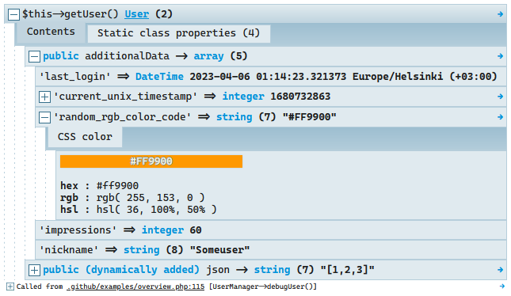

# Sage - Insightful PHP debugging assistant ☯

At first glance **Sage** is just an effortless, pretty replacement
for **[var_dump()](http://php.net/manual/en/function.var-dump.php)**
and **[debug_backtrace()](http://php.net/manual/en/function.debug-backtrace.php)**.

However, it's much, *much* more.

---



For an overview of Sage's outstanding features jump to the [F.A.Q.](#faq)

## Installation

```bash
composer require php-sage/sage --dev
```

#### Or if you prefer, [download the phar](https://github.com/php-sage/sage/raw/main/sage.phar) and simply

```php
<?php
require 'sage.phar';

sage('Hello, 🌎!');
```

## Usage

```php
sage($GLOBALS, $_SERVER); // dump any number of parameters

saged($i); // alias for sage();die;

sage(1); // shortcut for dumping trace
```

| Function    | Shorthand |                                                  |
|-------------|-----------|--------------------------------------------------|
| `sage`      | `s`       | Dump (same as `\Sage::dump()`)                   |
| `saged`     | `sd`      | Dump & die                                       |
| `ssage`     | `ss`      | Simple dump                                      |
| `ssaged`    | `ssd`     | Simple dump & die                                |
| `sagetrace` | `s(1)`    | Debug backtrace  (same as `\Sage::trace()`)      |
| ---         | `s(2)`    | Backtrace without the arguments - just the paths |

### Simple dump:


### Debug backtrace:


### More cool stuff 🤯

Sage determines the **passed variable name** and as a side effect can detect all sort of prefixes to the call. Use it
for some common on-the-fly adjustments to the dump output.

Examples:

```php
~ss($var); // outputs plain text
$output = @ss($var); // returns output instead of displaying it
! sage($var); // ignores depth limit for large objects
print sd($var); // saves output into "sage.html" in the current directory
print ! sd($var); // saves output into "sage.html" while also ignoring the output depth limit!
```

See [Advanced section](#-advanced-tips--tricks) below for more tricks.

### Verbose versions

If you want to use Sage as part of permanent code (e.g. part of a test helper/logger/exception reporter etc), you can
use the verbose way to invoke Sage:

```php
// instead of sage()
Sage::dump('this looks way less hacky (yeah right:)');

// equivalent to sage(1);
Sage::trace(); 

// equivalent to ssage():
Sage::enabled(Sage::MODE_TEXT_ONLY);
Sage::dump();

// a real-life test helper:
function getVarDump(mixed $providedContext): string
{
    if (! $providedContext) {
        return '';
    }

    Sage::enabled(Sage::MODE_TEXT_ONLY);
    Sage::$aliases[]         = __CLASS__ . '::' . __FUNCTION__;
    Sage::$returnOutput      = true;
    Sage::$displayCalledFrom = false;
    $debugOutput             = Sage::dump($providedContext);
    // now reset settings to presumed defaults
    Sage::enabled(true);
    Sage::$displayCalledFrom = true;
    Sage::$returnOutput      = false;

    return PHP_EOL . $debugOutput;
}
```

However, Sage is only a debug helper and is made with no guarantees it won't burn your house :)

----

# Customization options

Sage is designed with the utmost care to be as usable and useful out of the box, however there are several customization
options available for advanced users.

### Where to store customization?

#### If you use the `phar` version it does not get simpler:

```php
require 'sage.phar';
Sage::$theme = Sage::THEME_LIGHT;
```

#### If using `composer` you have several options:

1. Create a separate PHP config file and ask composer to autoload it for you:

   Add this entry to the `autoload.files` configuration key in `composer.json`:

```js
"autoload": {
  "files": [
  "config/sage.php" /* <--------------- this line */
  ]
},
```

2. Put settings inside of `php.ini`:

```ini
; change sage theme:
sage.theme = solarized-dark
; always display all dump levels, almost always crashes the browser:
sage.maxLevels = 0
; set your IDE links
sage.editor = vscode
; disable Sage unless explicitly enabled
sage.enabled = 0 
```

3. Include the desired settings in your bootstrap process anywhere™.

# All available customization options

```php
Sage::$theme = Sage::THEME_ORIGINAL;
```

Currently available themes are:

* `Sage::THEME_ORIGINAL`
* `Sage::THEME_LIGHT`
* `Sage::THEME_SOLARIZED`
* `Sage::THEME_SOLARIZED_DARK`

---

```php
Sage::$editor = ini_get('xdebug.file_link_format');
```

Make visible source file paths clickable to open your editor. Available options are:

* `'sublime'`
* `'textmate'`
* `'emacs'`
* `'macvim'`
* `'phpstorm'`
* `'phpstorm-remote'` - default,
  requires [IDE Remote Control](https://plugins.jetbrains.com/plugin/19991-ide-remote-control) plugin.
* `'idea'`
* `'vscode'`
* `'vscode-insiders'`
* `'vscode-remote'`
* `'vscode-insiders-remote'`
* `'vscodium'`
* `'atom'`
* `'nova'`
* `'netbeans'`
* `'xdebug'`

Or pass a custom string where %file should be replaced with full file path, %line with line number to create a custom
link. Set to null to disable linking.

---

```php
Sage::$displayCalledFrom = true;
```

Whether to display where Sage was called from

---

 ```php
Sage::$maxLevels = 7;
```

Max array/object levels to go deep, set to zero/false to disable

---

```php
Sage::$expandedByDefault = false;
```

Draw rich output already expanded without having to click

---

```php
Sage::$cliDetection = true; 
```

Enable detection when running in command line and adjust output format accordingly.

---

```php
Sage::$cliColors = true;
```

In addition to above setting, enable detection when Sage is run in *UNIX* command line. Attempts to add coloring, but if
opened as plain text, the color information is visible as gibberish.

---

```php
Sage::$charEncodings =  [
    'UTF-8',
    'Windows-1252', # Western; includes iso-8859-1, replace this with windows-1251 if you have Russian code
    'euc-jp',       # Japanese
]
```

Possible alternative char encodings in order of probability.

---

```php
Sage::$returnOutput = false;
```

Sage returns output instead of printing it.

---

```php
Sage::$aliases;
```

Add new custom Sage wrapper names. Optional, but needed for backtraces, variable name detection and modifiers to work
properly. Accepts array or comma separated string. Use notation `Class::method` for methods.

```php
// example, returns text-only output
function MY_dump($args)
{
    Sage::enabled(Sage::MODE_TEXT_ONLY);
    Sage::$returnOutput = true; // this configuration will persist for ALL subsequent dumps BTW!
    return d(...func_get_args());
}
Sage::$aliases[] = 'my_dump'; // let Sage know about it. In lowercase please.
```

---

# 🧙 Advanced Tips & Tricks

> this section is under construction :)

```php
// we already saw:
sage($GLOBALS, $_SERVER); 
// you can also go shorter for the same result:
s($GLOBALS, $_SERVER);
// or you can go the verbose way, it's all equivalent:
Sage::dump($GLOBALS, $_SERVER); 


// ss() will display a more basic, javascript-free display (but with colors)
ss($GLOBALS, $_SERVER);
// to recap: s() or sage() - dumps. Add "d" to die afterwards: sd(), saged()
// preppend "s" to simplify output: ss(), ssage().
// works in combination, too: ssd() and ssagedd() will dump in "simple mode" and die!

// prepending a tilde will make the output *even more basic* (rich->basic and basic->plain text)
~d($GLOBALS, $_SERVER); // more on modifiers below

// show a trace
Sage::trace();
s(1); // shorthand works too!
s(2); // trace - but just the paths 
Sage::dump( debug_backtrace() ); // you can even pass a custom result from debug_trace and it will be recognized

// dump and die debugging
sd($GLOBALS, $_SERVER); // dd() might be taken by your framework
saged($GLOBALS, $_SERVER); // so this is an equivalent alternative
ssd($GLOBALS, $_SERVER); // available for plain display too!

// this will disable Sage completely
Sage::enabled(false);
sd('Get off my lawn!'); // no effect
```

* Sage supports keyboard shortcuts! Just press <kbd>d</kbd> when viewing output and the rest is self-explanatory, try it
  out! (p.s.
  vim-style `hjkl` works as well);
* Call `Sage::enabled(Sage::MODE_PLAIN);` to switch to a simpler, js-free output.
* Call `Sage::enabled(Sage::MODE_TEXT_ONLY);` for pure-plain text output which you can save or pass around by first
  setting `Sage::$returnOutput = true;`
* Sage can provide a plain-text version of its output and does so automatically when invoked via PHP running in command
  line mode.

  

* Double clicking the `[+]` sign in the output will expand/collapse ALL nodes; **triple clicking** a big block of text
  will select it all.
* Clicking the tiny arrow on the **right** of the output will open it in a separate window where you can keep it for
  comparison.
* Sage supports themes:

  

  For customization instructions read the section below.
* If a variable is an object, its classname can be clicked to open the class in your IDE.
* There are several real-time prefix modifiers you can use (combinations possible):

  | Prefix |                                              | Example      |
  |--------|----------------------------------------------|--------------|
  | print  | Puts output into current DIR as sage.html    | print sage() |
  | !      | Dump ignoring depth limits for large objects | ! sage()     |
  | ~      | Simplifies sage output (rich->html->plain)   | ~ sage()     |
  | -      | Clean up any output before dumping           | - sage()     |
  | +      | Expand all nodes (in rich view)              | + sage()     |
  | @      | Return output instead of displaying it       | @ sage()     |

* Sage also includes a naïve profiler you may find handy. It's for determining relatively which code blocks take longer
  than others:

```php
Sage::dump( microtime() ); // just pass microtime() - also works if you pass NOTHING: s();
sleep( 1 );
Sage::dump( microtime(), 'after sleep(1)' );
sleep( 2 );
sd( microtime(), 'final call, after sleep(2)' );
```


---

## F.A.Q.

### 💬 How is it different or better than [symfony/var-dumper](https://symfony.com/doc/current/components/var_dumper.html)?

* Visible **Variable name**
* Keyboard shortcuts. Type <kbd>d</kbd> and the rest is just self-explanatory (use arrows, space, tab, enter, you'll get
  it!).
* **Debug backtraces** with full insight of arguments, callee objects and more.
* Custom display for a lot of recognized types:
  
* Has text-only, plain and rich views, has several visual themes - actually created by a pro designer.
* A huge amount of small usability enhancements - like the (clickable) **call trace** in the footer of each output.
* Supports convenience modifiers, for example `@sage($var);` will return instead of outputting, `-sage($var);`
  will `ob_clean` all output to be the only thing on page (see advanced section above for more).
* Compatibility! Fully works on **PHP 5.1 - 8.1+**!
* Code is way less complex - to read and contribute to.
* Sage came first - developed
  since [pre-2012](https://github.com/php-sage/sage/commit/3c49968cb912fb627c6650c4bfd4673bb1b44277). It inspired the
  now
  ubiquitous [dd](https://github.com/php-sage/sage/commit/fa6c8074ea1870bb5c6a080e94f7130e9a0f2fda#diff-2cdf3c423d47e373c75638c910674ec68c5aa434e11d4074037c91a543d9cb58R549)
  shorthand, pioneered a lot of the concepts in the tool niche.

### 💬 What are the other dumpers out there

* [Symfony/var-dumper](https://symfony.com/doc/current/components/var_dumper.html)
* [yii\helpers\VarDumper](https://www.yiiframework.com/doc/api/2.0/yii-helpers-vardumper)
* [Tracy](https://tracy.nette.org/)
* [PHP Debug Bar](https://github.com/maximebf/php-debugbar)
* [Kint](https://kint-php.github.io/kint/) - sage supersedes Kint.

### 💬 Why does Sage look so much like Kint? A.K.A. Why does this have so few stars?

Because it <b>is</b> Kint, and I am its author, however the project was [**forcibly taken over
**](https://github.com/kint-php/kint/commit/1ea81f3add81b586756515673f8364f60feb86a3) by a malicious
contributor!

Instead of fighting DMCA windmills, I chose to fork and rename the last good version and continue under a new name!

You can use Sage as a drop-in replacement for Kint. Simple.

### 💬 How is `var_dump` - style debugging still relevant when we have Xdebug?

1. In practice, Xdebug is quite often very difficult and time-consuming to install and configure.
2. There's many use-cases where dump&die is just faster to bring up.
3. There is no way you can visualise a timeline of changed data with XDebug. For example, all values dumped from within
   a loop.
4. And there's more subtle use-cases, eg. if you stepped over something there's no way to go back, but with var-dumping
   the values are still there...

I use xdebug almost daily, by the way. Side by side with Sage.

---

### Contributing

#### 🎲 Prerequisites

* Install [Docker Compose](https://docs.docker.com/compose/install/#install-compose').
* If you're on **Windows** 10+ you need to use WSL2:
    1. Setup: `wsl --install`
    2. Set Ubuntu as your default wsl shell: `wsl --set-version Ubuntu 2`.
    3. All commands listed below must be run from inside wsl shell: `wsl`

Do your changes but before committing run

```bash
 docker compose run php composer build
 # or (see Makefile):
 make build
```

To compile resources and build the phar file.

## Author

**Rokas Šleinius** ([Raveren](https://github.com/raveren))

Contributors: https://github.com/php-sage/sage/graphs/contributors

### License

Licensed under the MIT License

---

Hope you'll love using Sage as much as I love creating it!
