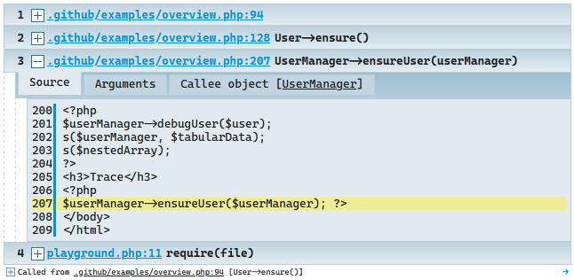

# Sage - Insightful PHP debugging assistant ☯

At first glance **Sage** is just a pretty replacement
for **[var_dump()](http://php.net/manual/en/function.var-dump.php)**
and **[debug_backtrace()](http://php.net/manual/en/function.debug-backtrace.php)**.

However, it's much, *much* more.

---

## 🔀 How is it different or better than [symfony/var-dumper](https://symfony.com/doc/current/components/var_dumper.html)?

For an overview of Sage's outstanding features jump to the [F.A.Q.](#faq)

## Installation and Usage

[Download the phar](https://github.com/php-sage/sage/raw/main/sage.phar) and simply

```php
<?php
require 'sage.phar';

d('hello 🌎!');
```

Or, if you use Composer:

```bash
composer require php-sage/sage --dev
```

### Basic usage:

```php
########## DUMP VARIABLE ###########################

sage($GLOBALS, $_SERVER); // any number of parameters

# or you can go shorter:
d($GLOBALS, $_SERVER);

# or you can go the verbose way, it's all the same:
Sage::dump($GLOBALS, $_SERVER); 


# s() will display a more basic, javascript-free display (but with colors)
s($GLOBALS, $_SERVER);

# prepending a tilde will make the output even more basic (rich->basic and basic->plain text)
~d($GLOBALS, $_SERVER); // how this works: https://stackoverflow.com/a/69890023/179104


########## DEBUG BACKTRACE #########################
Sage::trace();
// or via shorthand:
d(1);
// you can even pass the result of debug_trace and it will be recognized
Sage::dump( debug_backtrace() );


########## DUMP AND DIE #########################
dd($GLOBALS, $_SERVER); // dd() might be taken by your framework
ddd($GLOBALS, $_SERVER); // so here are some equivalent altenratives
saged($GLOBALS, $_SERVER);

sd($GLOBALS, $_SERVER); // for plain display


########## MISCELLANEOUS ###########################
# this will disable Sage completely
Sage::enabled(false);

ddd('Get off my lawn!'); // no effect

```

## Tips & Tricks

> This section will have to do until I muster up the motivation to do proper documentation.

* Sage can provide a plain-text version of its output and does so automatically when invoked via PHP running in command line mode.

  
* `Sage::enabled(Sage::MODE_PLAIN);` will switch to a js-free version, and `Sage::enabled(Sage::MODE_TEXT_ONLY);` will give you plain text output which you can save or pass around by first setting `Sage::$returnOutput = true;`
* You can create your wrapper function with custom configuration and what not and Sage will treat it like one of its own:
```php
function MY_dump($args)
{
    Sage::enabled(Sage::MODE_TEXT_ONLY);
    Sage::$returnOutput = true; // this configuration will persist for ALL subsequent dumps BTW!
    return d(...func_get_args());
}
Sage::$aliases = 'my_dump'; // let Sage know about it. In lowercase please.
```
* Double clicking the `[+]` sign in the output will expand/collapse ALL nodes; **triple clicking** a big block of text
  will select it all.
* Clicking the tiny arrow on the **right** of the output will open it in a separate window where you can keep it for comparison.
* If a variable is an object, its classname can be clicked to open the class in your IDE.
* There are a couple of real-time modifiers you can use:
  * `~d($var)` this call will output in plain text format.
  * `+d($var)` will disregard depth level limits and output everything (careful, this can hang your browser on huge
    objects)
  * `!d($var)` will show uncollapsed rich output.
  * `-d($var)` will attempt to `ob_clean` the previous output - useful when Sage is obscured by already present HTML.

  [Here's a little bit](https://stackoverflow.com/a/69890023/179104) on how it works.

* To change the **theme**, use `Sage::$theme`, available options are:
  * `Sage::$theme = Sage::THEME_ORIGINAL;`
  * `Sage::$theme = Sage::THEME_LIGHT;`
  * `Sage::$theme = Sage::THEME_SOLARIZED;`
  * `Sage::$theme = Sage::THEME_SOLARIZED_DARK;`

  
* Sage also includes a naïve profiler you may find handy. It's for determining relatively which code blocks take longer
  than others:

```php
Sage::dump( microtime() ); // just pass microtime()
sleep( 1 );
Sage::dump( microtime(), 'after sleep(1)' );
sleep( 2 );
ddd( microtime(), 'final call, after sleep(2)' );
```


----

## Configuration

Sage is designed with the utmost care to be as usable and useful out of the box, however there are several configuration
options for you to customize.

#### Where to store configuration?

If you use the phar version it does not get simpler:

```php
require 'sage.phar';
Sage::$theme = Sage::THEME_LIGHT;
```

For composer you have several options:

1. Create a separate PHP config file and ask composer to autoload it for you:

   Add this entry to the `autoload.files` configuration key in `composer.json`:

```javascript
"autoload": {
  /* ... */
  "files": [
    "config/sage.php" /* <--------------- this line */
  ]
},
```

2. Put settings inside of `php.ini`:

```ini
; change sage theme:
sage.theme = solarized-dark
; always display full trace:
sage.maxLevels = 0
; it's been 10 years, and this is still not working, Jetbrains, PLEASE!:
sage.fileLinkFormat = phpstorm://open?file=%f&line=%l
; and so on
```

3. Include the desired settings in your bootstrap process anywhere™.

## F.A.Q.

### 💬 What sets Sage apart from symfony/var-dumper?

* Visible **Variable name**
* Keyboard shortcuts. Type <kbd>d</kbd> and the rest is just self-explanatory.
* **Debug backtraces** with full insight of arguments, callee objects and more.
  
* Custom display for a lot of recognized types:
  
* Has text-only, plain and rich views, is trivial to configure, has several visual themes - actually created by a pro designer.
* A huge amount of small usability enhancements - like the (clickable) call **trace** in the footer of each output.
* Supports convenience modifiers, for example `@sage($var);` will return instead of outputting, `-sage($var);` will `ob_clean` all output to be the only thing on page.
* Supports PHP 5.1+. That's the lowest physically possible version to extend compatibility to. Next time you headbang on something incredibly legacy, remember Sage!
* Is way less complex - to read if you want to learn a bit of PHP internals.

#### 💬 How is it worse?

* Does not come pre-bundled with your cool framework (but it is zero-setup!)
* Although Sage predates var-dumper, and I'm pretty sure it ["inspired"](https://github.com/php-sage/sage/commit/fa6c8074ea1870bb5c6a080e94f7130e9a0f2fda#diff-2cdf3c423d47e373c75638c910674ec68c5aa434e11d4074037c91a543d9cb58R549) the widespread use of the wonderful shorthand `dd`, I stepped down to let var-dumper use this name. To dump & die with Sage you can `ddd()` or `saged()`
* There's no such feature as a dump server, at least until someone convinces me it's actually useful.
* It's not made by Symfony foundation nor does it have industry-grade backing & support. It's made buy just this one guy (and [contributors](https://github.com/php-sage/sage/graphs/contributors)) since [pre-2012](https://github.com/php-sage/sage/commit/3c49968cb912fb627c6650c4bfd4673bb1b44277).


### 💬 How is `var_dump` - style debugging still relevant when we have Xdebug?

1. In practice, Xdebug is quite often very difficult and time-consuming to install and configure.
2. There's many usecases where dump&die is just faster to bring up.
3. There is no way you can visualise a timeline of changed data with XDebug. For example, all values dumped from within a loop.
4. And there's more subtle usecases, eg. if you stepped over something there's no way to go back, but with var-dumping the values of interest are still there in the output...

I use xdebug almost daily, by the way. Side by side with Sage.

### 💬 Why does this look so much like Kint?

Because it **IS** [Kint](https://github.com/kint-php/kint), and I am its author, however the project
was [blatantly stolen](https://github.com/kint-php/kint/commit/1ea81f3add81b586756515673f8364f60feb86a3) from me by a
malicious contributor!

Instead of fighting windmills, I chose to fork and rename the last good version and continue under a new name!

---

## Author

**Rokas Šleinius** ([Raveren](https://github.com/raveren))

### License

Licensed under the MIT License

---

Hope you love using Sage as much as I love creating it!

☯